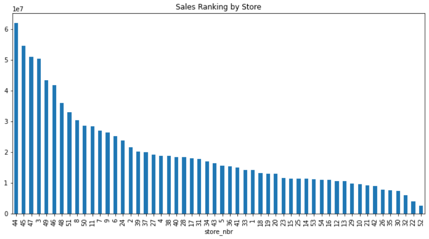
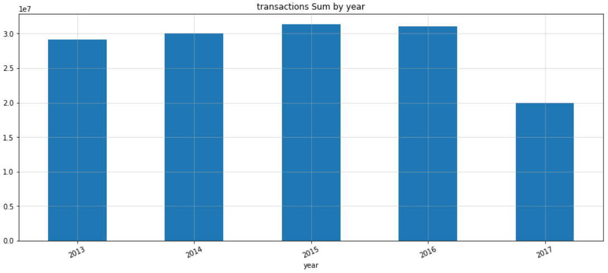

# Kaggle-Store-Sales__Time-Series-Forecasting

    

## 0. 대회 정보
- 대회목표: 본 대회는 에콰도르에 본사를 둔 대형 생필품 소매업체인 Corpación Favorita의 데이터를 이용한 상점 매출 예측입니다. 온라인 쇼핑몰의 코너에서 판매되는 수천 개 품목에 대한 매출을 정확하게 예측해야 합니다. 매출을 예측하는 것에는 소매업체들의 요구사항, 계절적 변화, 임금 지불 등 에콰도르 시장의 문화들을 고려해야하는 복잡한 문제들을 수반합니다. 
- 주최기관: Corpación Favorita
- 대회링크 (https://www.kaggle.com/competitions/store-sales-time-series-forecasting/overview)

## 1. 데이터
- store_nbr은 제품이 판매되는 스토어를 식별합니다.
- family는 판매된 제품 유형을 식별합니다.
- sales(target_column)은 지정된 날짜에 특정 상점에서 제품군에 대한 총 매출을 제공합니다. 분수 값(ex. 설탕 1.5kg)도 가능합니다.
- onpromotion은 지정된 날짜에 스토어에서 프로모션을 수행하던 제품군의 총 항목 수를 제공합니다.
- cluster는 유사한 저장소 그룹입니다.

- train.csv
    - (3000888, 6)
    - columns : id, date, store_nbr, family, sales, onpromotion
- test.csv
    - (28512, 5)
    - columns : id, date, store_nbr, family, onpromotion
- sample_submission.csv
    - (28512, 2)
    - columns : id, sales
- stores.csv
    - (54, 5)
    - columns : store_nbr, city, state, type, cluster
- oil.csv
    - (1218, 1)
    - columns : date, dcoilwtico
- holidays_events.csv
    - (350, 6)
    - columns : date, type, locale, lacale_name, description, transferred
    
- transaction.csv
    - (83488, 3)
    - columns = date, store_nbr, transactions

## 2. EDA
- 참고 사항
    - 에콰도르에서는 공공 부문에서 근로하는 근로자들의 임금이 15일과 마지막 날 등 2주에 한 번 지급 됩니다. 슈퍼마켓 판매는 이것에 의해 영향 받을 수 있습니다.
    - 2016년 4월 16일 에콰도르에서 규모 7.8의 지진이 발생했습니다. 사람들은 발생 후 몇 주 동안 슈퍼마켓 판매에 큰 영향을 미친 물과 다른 필요한 제품을 기부하는 구호 활동에 모이는 등 데이터 자체 뿐만 아니라 전체적인 에콰도르 당시의 상황, 사건에도 함께 주목을 해야합니다.

EDA 링크 (https://public.tableau.com/app/profile/.24806894/viz/_16614976805320/1 target="_blank")
 EDA 링크2 (https://public.tableau.com/app/profile/.24806894/viz/states_16615888582370/1_1?publish=yes)

    

- 한 달 기준으로 날날이 수집한 매출액의 평균입니다. 에콰도르 공공부문 급여날이 15일과 매월 말일을 고려해 본다면, 16일 기준으로 매출 평균이 증가하고, 마지막 날인 31일, 그 담음달 월초가 높게 나온다고 보일 수 있습니다.

    

- 한 달 기준으로 날날이 수집한 매출액의 합계입니다.

    

- 요일별 매출액 평균입니다. 토요일, 일요일 등 주말에 매출액의 평균이 높음을 확인 할 수 있습니다.

    

    

- 매출량과 프로모션 진행 횟수를 내림차순으로 만들어 놓은 그래프입니다. 상위 5개(44, 45, 47, 3, 49)와 하위 5개(52,22,32,30,35)를 프로모션 횟수 데이터를 이용하여 인사이트를 찾아 보았습니다. 프로모션 횟수 상위 5개(53, 47, 44, 45, 46)과 하위 5개(52, 32, 22, 30, 10)으로 확인하였습니다. 어느정도 유사성은 있어 보이나 완벽히 비례한 상관관계를 유지한다고 생각하기엔 무리가 있어 보입니다.( 상관관계 : 0.4)

    

- 프로모션 진행 횟수와 매출량을 표현하였습니다.

    

- 2013-01-01 ~ 2017-08-08일까지 기름 가격의 변화 추이를 그래프로 나타내었습니다.

    

- 휴일 type 별 매출액의 평균을 나타내었습니다. 국가 공휴일과 이전된 날짜의 휴일에서 가장 많은 매출 평균을 기록하였고, Work Day와 Holiday에서 가장 낮은 매출 평균을 기록 하였습니다.

    

- store_nbr 별 거래량을 표시하였습니다.

    

- 년도별 거래량 합계 입니다. 2016년 다소 주춤하였고, 2017년은 8월까지 밖에 기록 되지 않았지만, 2013년 부터 약진을 하고 있음을 알 수 있습니다.

    

- 날짜별 거래량 추이입니다. 

    

- 월별 거래량 추이입니다. 12월이 눈에 띄게 많은 평균 거래량을 기록하고 있습니다.

## 3. 모델 선정

## 4. 모델 시행 결과

## 5. 프로젝트 결과
